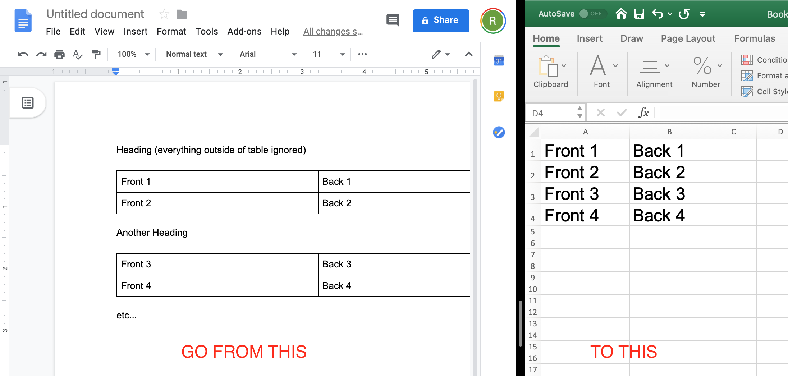

# Gdocs Flash Card Maker

Accesses a docs file in your Google Drive and converts one or more tables in the document into an excel file. This file can be uploaded
to flash card website(e.g. [Quizlet](https://help.quizlet.com/hc/en-us/articles/360029977151-Creating-sets-by-importing-content), [Cram](https://www.cram.com/flashcards/create).

The table should be two columns. Each card is one row, where the left cell is the front of the flashcard and the right cell is the back. Text outside of tables is ignored.

Please note, this is very sloppy at this point, with almost no error handling; I wrote it in an afternoon with the intention of only using it myself to convert my class notes to flashcards, but am posting because of interest from others.

## Prerequisites

1. Python 3.7+
2. Google Drive account

## Getting Started

1. Download repo.
2. Install dependencies in requirments.txt (`pip install -r /path/to/requirements.txt`).
3. Get setup to use the Google Drive API by following the steps below, reprinted from the wonderful [PyDrive package tutorial](https://pythonhosted.org/PyDrive/quickstart.html).
    1. Go to [APIs Console](https://console.cloud.google.com/cloud-resource-manager) and make your own project.
    2. Search for ‘Google Drive API’, select the entry, and click ‘Enable’.
    3. Select ‘Credentials’ from the left menu, click ‘Create Credentials’, select ‘OAuth client ID’.
    4. Now, the product name and consent screen need to be set -> click ‘Configure consent screen’ and follow the instructions. Once finished:
        a. Select ‘Application type’ to be Web application.
        b. Enter an appropriate name.
        c. Input http://localhost:8080 for ‘Authorized JavaScript origins’.
        d. Input http://localhost:8080/ for ‘Authorized redirect URIs’.
        e. Click ‘Save’.
    5. Click ‘Download JSON’ on the right side of Client ID to download client_secret_<really long ID>.json.
    6. The downloaded file has all authentication information of your application. Rename the file to “client_secrets.json” and place it in repo directory.
4. in gdocs-flash-card-maker.py set DOCUMENT_ID to the id of your Google Drive Document and PATH_TO_OUTPUT to the path of excel file to be created (include file name).
5. Run gdocs-flash-card-maker.py (from command line cd to the directory and enter `python gdocs-flash-card-maker.py`)
On your first run you will be asked to log into your account.

## Acknowledgments

* [PyDrive](https://pythonhosted.org/PyDrive/quickstart.html) has wonderful documentation (partially copied above)
* [Google API Tutorials](https://developers.google.com/docs/api/how-tos/tables) were also helpful
* Thanks to Cram for not restricting programmatic upload of excel files. This functionality isn't (yet!) in the script, but I may add.

## License

This project is licensed under the MIT License - see the [LICENSE.md](LICENSE.md) file for details
